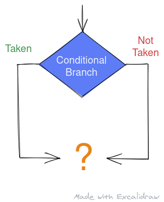
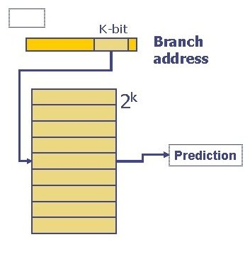

In this post, we'll take a brief look at branch prediction. To learn more about branch prediction and the hardware implementation of branch predictors, you can watch the lectures on branch prediction by <a href="https://people.inf.ethz.ch/omutlu/" target="_blank">Onur Mutlu</a> (link opens a new tab), professor at ETH Zurich, previously at Carnegie Mellon - <a href="https://youtu.be/h6l9yYSyZHM" target="_blank">Branch Prediction I</a> (link opens a new tab) and <a href="https://youtu.be/z77VpggShvg" target="_blank">Branch Prediction II</a> (link opens a new tab) from <a href="https://youtube.com/playlist?list=PL5Q2soXY2Zi_FRrloMa2fUYWPGiZUBQo2" target="_blank">Digital Design and Computer Architecture playlist</a> (link opens a new tab) of Spring Semester, 2020 at ETH Zürich.

 

<center>
Alt: An illustration showing the need for branch prediction to speculate the direction of conditional branches for speculative execution
<br/>
Made with <a href="https://excalidraw.com/" target="_blank">https://excalidraw.com/</a> (link opens a new tab)
</center>


## Need for branch prediction

When a processor encounters a branch instruction - it has to decode the instruction to find the target of the branch. In case of a conditional branch, the direction of branch also depends on the values in the Flag Registers - you can read more about these registers in Wikipedia article titles <a href="https://en.wikipedia.org/wiki/FLAGS_register" target="_blank">FLAGS register</a> (link opens a new tab). Based on the results of previous operations, these flags are set and decide the direction of current branch.


<center>
Alt: Diagram of a 5 stage pipeline in RISC systems showing how different stages of pipeline are busy at any given clock cycle. (IF = Instruction Fetch, ID = Instruction Decode, EX = Execute, MEM = Memory access, WB = Register write back). In the fourth clock cycle (the green column), the earliest instruction is in MEM stage, and the latest instruction has not yet entered the pipeline.
<br/>
Source (link opens a new tab): <a href="https://www.quora.com/What-is-CPU-pipelining" target="_blank">https://www.quora.com/What-is-CPU-pipelining</a>
</center>
<br/>
 

In a modern out of order processor, decoding an instruction and predicting branch direction in case of conditional branches make take some time - a lot longer if processor is waiting for data that decides the direction of branch as a result of L1 / L2 cache miss.

In such a case, the processor predicts the outcome of the branch and speculatively starts executing down the predicted path until the branch can be resolved.


## Evolution of Branch Predictors

The earliest predictors were a one bit counter. The counter value indicated the direction of previous branch - 0 for not taken and 1 for taken. The prediction for current branch would depend on previous branch and the result of current branch will update the counter for prediction regarding next branch. AS it turns out even one bit counters were fairly accurate at prediction but the high cost of flushing the pipeline in case of mis-prediction means these predictors needs to be as accurate as possible to improve performance.

The next evolution was a two bit saturated counter, where the state 00 indicated there is a strong chance branch is not taken, state 01 meant there is a good possibility branch will be not taken, state 10 meant there is a good possibility branch will be taken and state 11 meant there is a great chance branch will be taken. The diagram below shows the transition between the state based on the result of current branch:


<center>
Alt: Diagram showing transitions in a 2 bit counter - For state 00, the state remains same if the prediction for branch not taken is correct, else there is a transition to state 01. For state 01, on branch not taken, there is a transition to 00, else if branch is taken we  jump to 10. If on state 10, branch is not taken, we dial back to 01 else we jump to 11. In state 11, if branch is taken we stay on 11 else on branch not taken we change to state 10.
<br/>
Source (link opens a new tab): <a href="https://www.researchgate.net/figure/2-bit-saturating-counter_fig1_333641705" target="_blank">https://www.researchgate.net/figure/2-bit-saturating-counter_fig1_333641705</a>
</center>
<br/>

The transitions are as follows:

- State 00 predicts the branch will not be taken. If the branch is not taken, it stays  on 00. If branch is taken despite the prediction, the state transitions to 01 getting closed to the "taken" prediction.
- State 01 predicts branch will not be taken (although with not as large a probability as state 00). If the branch is indeed not taken the state transitions to 00 indicating a bigger probability next branch might also not be taken. If the branch is taken, the state transitions to 10.
- State 10 predicts branch will be taken with moderate probability. If the branch is indeed taken the state transitions to 10 indicating a high probability next branch will be taken. If the branch is not taken despite the prediction, the state transitions to 01.
- State 11 strongly predicts for the branch to be taken. If the branch is indeed taken the state remains the same. If not the state transitions to 01 indicating weakening in probability for branch being taken.

Unlike a single bit predictor, two bit predictor depends on a larger branch history to predict next branch. Slightly better accuracy was achieved with more states and more transition. Modern processors have graduated from just predicting direction of branch to predicting the jump right from the program counter without even decoding instruction.

 
## Branch History Table

One single counter for all the branches doesn't give a clear picture for all branches. To address this, the single branch predictor now became a branch history table.

The table is looked up using the pc of the branch instruction to predict whether it would be taken or not. The diagram below shows a simple schematic of a branch history table.
 

<center>
Alt: The figure shows a branch history table that uses k bits from lower half of branch address to find prediction
<br/>
Source (link opens a new tab): <a href="https://slidetodoc.com/lecture-9-branch-prediction-basic-idea-saturating-counter/" target="_blank">https://slidetodoc.com/lecture-9-branch-prediction-basic-idea-saturating-counter/</a>
</center>
</br>


**Note**: There are several ways to design and realize a Branch History Table. Some microarchitecture implement a branch history register and that along with the prediction from the table gives the final prediction. To know more about them I highly recommend you to watch Onur Mutlu's videos liked above on Brach Predictors.

 
## Branch Target Buffer

Modern processors implement a lookup table known as branch target buffer in hardware that stores the program counter for the jump instruction, the program counter in case the branch is taken and a prediction counter to predict the direction of branch. If the branch is predicted to be taken, the current program counter is replaced by the program counter for the branch taken condition retrieved from the lookup table, else the program counter is incremented as normal generally pc = pc + 4 (considering 4 byte instruction size)

The image below shows the design of Branch Target Buffer in hardware:


<center>
Alt: The diagram shows a branch target buffer, a table with entries of PC of branch instruction, the pc if the branch is taken and a n bit predictor that predicts the direction of the branch. At every cycle, the current pc is looked up in the Branch Target Buffer to know if it is a branch or not and if it is, based on the prediction bits, the program counter is speculatively updated to the resultant program counter for branch taken from the branch target buffer
</a>
Source (link opens a new tab): <a href="https://slidetodoc.com/lecture-9-branch-prediction-basic-idea-saturating-counter/" target="_blank">https://slidetodoc.com/lecture-9-branch-prediction-basic-idea-saturating-counter/</a>
</center>


## How sensible is branch prediction?

Consider a RISC based pipeline with 5 stages and 10% of instructions are branch instructions. Consider a branch can be predicted with an accuracy of 99% (branch predictors in modern processors are in fact this accurate).

```
For every 1000 instructions, there are 100 branch instruction out of which 99 can be predicted correctly.
Total cycles to run 1000 instruction
= 4 + 999 (comes from the pipelined nature)
+ 2 (2 cycles wasted until the branch is resolved)
+ 5 (cycles added as a result of flush)
= 1010 cycles

Consider a pipeline that adds 2 nop (no operation) in pipeline before every branch instruction
= 4 + 999 (comes from the pipeline nature)
+ 2 * 100 (2 nop for 100 branch instruction)\
= 1203  cycles
```

We can observe there is a clear performance gain with branch prediction compared to adding nops down the pipeline.


## Coming up next

This is a brief introduction to branch prediction and hardware behind it. This is in no way a comprehensive look but it covers enough to give a foundation for the exploit we'll cover later named Spectre.

**This might sound repetitive by now but to get solid understanding of branch predication - from reasoning behind it, to realization in hardware - I highly recommend watching Onur Mutlu's lectures linked at the beginning of this post. His lectures are an invaluable resource for people looking to understand computer architecture and microarchitecture implementation of these concepts in modern processors and I highly recommend watching the entire playlist to get a good understanding of braoder picture of computer architecture.**


Thank you for reading till the end. I'm an undergraduate student keenly interested in Computer Architecture and I look at micro-architectural based attacks to understand more about the working of our hardware. If you find any inaccuracies in the above post, please leave a comment and I'll address it in the next edit. Have a nice day!