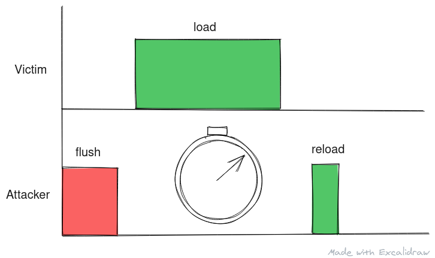
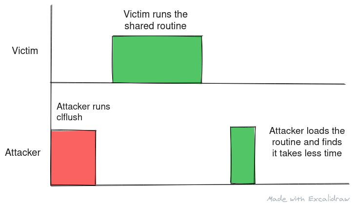

This is the second post in series of timing analysis. If you haven't read the first post - Timing Analysis (link opens a new tab), I highly recommend reading it to understand why these attacks are possible. If you have an idea of inclusive cache hierarchy and how OS loads shared library into virtual memory, you can continue with reading this article.

In this post, we will look at **Flush and Reload**


<center>
Alt: An illustration depicting flush and reload attack using timing diagram<br/>
Made with <a href="https://excalidraw.com/" target="_blank">https://excalidraw.com/</a> (link opens a new tab)
</center>

 
### Cache Placement

Cache can be designed in few different ways. Cache has to store address and the data at that address. We have to map an address to a particular cache line and depending on design, there is a tradeoff between data retention in case of conflict and time to access. The following are the popular mapping (taught at an undergraduate level) for mapping addresses to cache line:

- Direct Mapping (1:1 associative) - Each address can be uniquely mapped to a particular cache line. For example, assume a system with 4 cache line that stores one byte each, (address % 4) gives the cache line to load data into.
- Set Associative (1:m associative) - Each address can be mapped to m cache lines - This is known as a cache set. Modifying above example consider a cache set with 2 lines, the data at address will get loaded into (address % 2) cache set.
- Fully associative - Here any address can be stored in any cache lines. The circuit used to resolved the correct cache line for a given address is more complicated than the other two.

To read more about cache placement policies, you can read the Wikipedia article titled <a href="https://en.wikipedia.org/wiki/Cache_placement_policies" target="_blank">Cache Placement Policy</a> (link opens a new tab).

The main takeaway here is, with most popular design, the cache set for a data can be determined from the address. In case a new data is to be brought in to a set that is occupied, data needs to be evicted to make room for the new data. To know more about cache replacement, you can read the Wikipedia article titled <a href="https://en.wikipedia.org/wiki/Cache_replacement_policies" target="_blank">Cache Replacement Policy</a> (link opens a new tab).

The diagram below depicts cache eviction in case of conflict for direct associative cache.
<center>
 
Alt: Address 400 is resolved to cache line 0
 
Alt: Data at address 400 is loaded into cache line 0

 
Alt: Address 480 is resolved to cache line 0

 
Alt: Data at address 480 is loaded into cache line 0 overwriting previous data
 
Alt: Address 400 is resolved to cache line 0
 
Alt: Data at address 400 is loaded into cache line 0 overwriting previous data

Cache thrashing in case of directly mapped cache here consecutive loads are resolved to same cache line thus over writing one another and degrading performance<br/>
Made with <a href="https://excalidraw.com/" target="_blank">https://excalidraw.com/</a> (link opens a new tab)
</center>


## CLFLUSH

clflush is an x86 instruction that is used to flush a cache line corresponding to specific address through the entire cache hierarchy. If you are interested to learn more about clflush instruction, you can visit <a href="https://www.felixcloutier.com/x86/clflush" target="_blank">https://www.felixcloutier.com/x86/clflush</a> (link opens a new tab).

The important point with clflush is that it can be used at any privilege level and hence ever a program running in userspace with basic execution privilege can still run the clflush instruction. This allows for attacker to exploit clflush without escalating privilege level.


## Flush and Reload

In flush and reload, the attacker thread flushes a particular cache line or a cache set where the shared library will be loaded. As we know the address beforehand, we only have to observe a small part of cache which makes this an efficient technique.

Once flushed, the attacker waits for a small amount of time before loading the shared library themself. If the call resolves quicker than expected, we realize the routine is cached in the last level cache shared between the hardware threads. As the attacker had flushed this cache line previously, they can now determine that the victim thread has called the shared library routine.

Based on this timing analysis, the attacker thread can track events on the victim thread.


<center>
Alt: An image that illustrates how the timing changes with cached and un-cached data exaggerated for emphasis.<br/>
The picture is made using <a href="https://excalidraw.com/" target="_blank">https://excalidraw.com/</a> (link will open a new tab)
</center>


## Leaking secrets

To leak secrets, the victim thread must have a gadget that calls a shared library based on a secret. Consider the following code snippet:

```cpp
unsigned int secret;
while (secret)
{
        if (secret & 1)
        {
                shared_library_routine();
        }
        secret = secret >> 1;
}
```


Based on timing analysis, the attacker thread can detect if **shared\_library\_routine()** is called by the victim and we know that this call happens only if the least significant bit of shifting secret is 1 and the attacker can decipher the entire secret just based on timing analysis.


## Complications

Flush and reload have the following complications associated with it:

- The attacker and victim should run on the same physical core on separate threads at the same time.
- The attacker and victim should share the last level cache. Without shared cache, this type of attack will not work.
- The micro-architecture must implement a form of clflush instruction to facilitate flush and reload.
- The timing between the flush and reload is important. If the timing is not right, the attacker might misinterpret the secret.

 
### Scenarios with Flush and Reload

The following images depicts the optimal flush and reload scenario:

 
<center>
Alt: The attacker runs the flush, the victim runs the shared routine, the attacker then loads the same routine to find that it is cached based on timing and interprets a part of secret.
</center>

 
<center>
Alt: The attacker runs the flush, the victim doesn't the shared routine, the attacker then loads the same routine to find that it is not cached based on timing and interprets a part of secret.
</center>
<br />
<br />

The following are scenarios where attacker didn't time the flush and reload correctly:  
 
<center>
Alt: The attacker runs the flush, the victim runs the shared routine twice by the time the attacker loads the same routine to find that it is cached based on timing. In doing so attacker misses a part of the leak.
</center>


<center>
Alt: The attacker runs the flush, the victim runs the shared routine but the attacker's load of the same routine is too quick and overlaps with the load of the victim. In doing so attacker misses interprets a part of the leak as the time taken is closer to that of a cache miss.
<br/>
All images are made using <a href="https://excalidraw.com/" target="_blank">https://excalidraw.com/</a> (link will open a new tab)
</center> 


## Coming up next

In the next post we'll look at Prime and Probe - a an alternative to Flush are Reload technique that works on systems that don't implement a variant of clflush instruction.


Thank you for reading till the end. I'm an undergraduate student keenly interested in Computer Architecture and I look at micro-architectural based attacks to understand more about the working of our hardware. If you find any inaccuracies in the above post, please reach out to me and I'll address it in the next edit. Have a nice day!