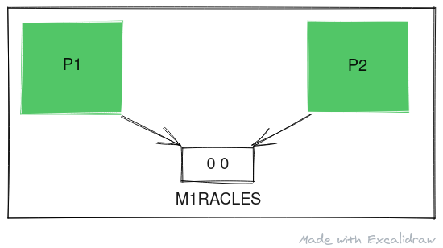
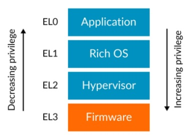
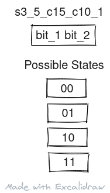
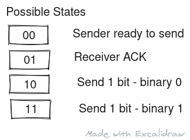

This bug in Apple M1 was discovered by <a href="https://twitter.com/marcan42" target="_blank">Hector Martin</a> (link opens a new tab) during his research for adding GNU/Linux support for Apple M1 through his <a href="https://asahilinux.org/" target="_blank">Asahi Linux Project</a> (link opens a new tab). His website discussing this bug in detailed is titled <a href="https://m1racles.com/" target="_blank">M1RACLES: M1ssing Register Access Controls Leak EL0 State</a> (link opens a new tab). If you are familiar with privilege levels and register accesses, you an directly head over to Hector's blog and read the much more detailed and in-depth review of the bug he found. Please do go check out his awesome awesome work after reading this article.

Alt: A Schematic diagram of M1RACLES showing two processes transmitting data to each other over a covert channel
 
Made with <a href="https://excalidraw.com/" target="_blank">https://excalidraw.com/</a> (link opens a new tab)

## Privilege Levels in ARM-v8

Hector's blog goes into details of the bug but I'm writing this from the perspective of myself, a complete beginner, and summarizing the concept on the way up. First I would like to discuss EL0 - the E in M1RACLES. ARM-v8, like any other architecture, comes with a set of privilege level that dictate the capabilities of the program running at that level. The different levels are as shown below:

Alt: A diagram showing the different privilege levels of ARM architecture with EL0 on top with least privilege where user application run, followed by EL1, the operating system level, followed by EL2, the hypervisor level, and finally EL3 the firmware level.
 
Source (link opens a new tab): <a href="" target="_blank">https://developer.arm.com/documentation/102412/0100/Privilege-and-Exception-levels</a>

As we go down the stack, the privilege increases as we gradually go closer to the hardware. These privilege levels guard memory and register access and trap invalid accesses.

What EL0 means is that any user land program can use this functionality and hence M1RACLES is possible from a userspace program.

## Missing Registers

Apple M1 contains a two bit ARM System Register encoded as s3_5_c15_c10_1 that is accessible across all the processing core of the processor. In addition to this, it is EL0 accessible for both reads and writes and hence can be used to transmit data across processes.

Alt: The diagram shows the schematic of the two bit register s3_5_c15_c10_1 with possible states as 00, 01, 10 and 11
 
Made with <a href="https://excalidraw.com/" target="_blank">https://excalidraw.com/</a> (link opens a new tab)

## Transmitting Data

How do you use this two bit register to transmit data? Well you make a 2 bit data transfer protocol. The diagram below shows one such possible protocol:

Alt: Each state of register corresponds to a transmission state - 00 means sender is ready to send, 01 is used by receiver to acknowledge receiving sender's states. 10 means sender is sending binary bit 0 and 11 means sender is sending binary 1
 
Made with <a href="https://excalidraw.com/" target="_blank">https://excalidraw.com/</a> (link opens a new tab)

Let us now see how to send binary data "101" using this protocol between to processes:

Alt: The sender first sets register state to 00 indicating he is ready to send. Receiver ACKs this by writing 01 to the register. Sender sends 11 implying bit 1. The receiver ACKs this with 01. The sender sends 10 next indicating bit 0. The receiver ACKs with 01. The sender sends 11 next indicating bit 1. The receiver ACKs this with 01.  The sender finally writes 00 indicating transmission has finished and is ready for next transmission. The receiver interprets the message received as 101.
 
Made with <a href="https://excalidraw.com/" target="_blank">https://excalidraw.com/</a> (link opens a new tab)

## How serious is this vulnerability?

This vulnerability has very low impact as it can only send data between two cooperating processes. What is interesting is the existence of this vulnerability in Apple A14 processor - <a href="https://twitter.com/_saagarjha" target="_blank">Saagar Jha</a> (link opens a new tab) has a nice tweet that demos this vulnerability you can find here- <a href="https://twitter.com/_saagarjha/status/1397515649530830852" target="_blank">https://twitter.com/_saagarjha/status/1397515649530830852</a>. Could this mean this covert channel can be used by apps to send user tracking information amongst each other? Probably not as outlined by Hector himself in <a href="https://m1racles.com/#ios" target="_blank">iOS section of M1RACLES site</a> (link opens a new tab). The only reason this is a vulnerability is because it goes against the principles of operating system by adding a cover channel for Inter Process Communication. Between cooperating processes, the data can be transmitted at 1MB/s as seen in Hector's <a href="https://youtu.be/hLQKrEh6w7M" target="_blank">M1RACLES demo on YouTube</a> (link opens a new tab) where the sender is streaming video data to a receiver and receiver then playing it.

## Any mitigation in sight?

As this access to registers is possible across cores, there aren't any straightforward mitigation to implement. If it was across a single core, Hector mentioned the idea of clearing the register on context switches making them an ineffective side channel. If you are running in a virtualized environment, the hypervisor traps access to the register and hence this cover channel disappears. Only on bare metal is this possible.

Again in words of Hector himself, this side channel is almost inconsequential compared to the cache based side channel that can transmit data across cooperative processes much more effectively.

This is the link to Hector's thread where he first disclosed this vulnerability - <a href="https://twitter.com/marcan42/status/1397387066044911618" target="_blank">https://twitter.com/marcan42/status/1397387066044911618</a> (link opens a new tab). It is a worthwhile read I promise with people chipping in their opinion and possible enhancement to data transmission protocol for better throughput.

Thank you for reading till the end. I'm an undergraduate student keenly interested in Computer Architecture and I look at micro-architectural based attacks to understand more about the working of our hardware. If you find any inaccuracies in the above post, please leave a comment and I'll address it in the next edit. Have a nice day!