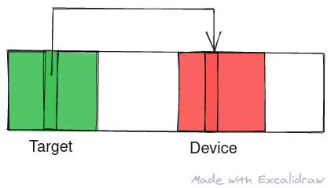
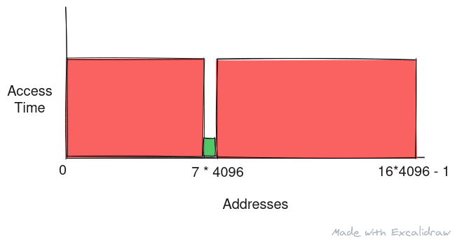

This article is based on the paper:

<center>
<a href="https://meltdownattack.com/meltdown.pdf" target="_blank">
M. Lipp, M. Schwarz, D. Gruss, T. Prescher, W. Haas, A. Fogh, J. Horn, S. Mangard, P. Kocher, D. Genkin, Y. Yarom, and M. Hamburg,
<br/>
“Meltdown: Reading Kernel Memory from User Space,”  Tech. Rep.,2018.
</a>
<br/>
(link opens a new tab with pdf of paper ~ 258kB)
<br/>
Source (link opens a new tab): <a href="https://meltdownattack.com/" target="_blank">https://meltdownattack.com/</a>
</center>
<br/>

In this article we'll take a brief look at Meltdown attack however I highly recommend reading the paper mentioned above that goes into more depth about the cause and methods of exploit.



<center>
Alt: An illustration of Meltdown on how data at target can be captured by a location in a device
<br/>
Made with <a href="https://excalidraw.com/" target="_blank">https://excalidraw.com/</a> (link opens a new tab)
</center>


## Memory layout

Note: This as the memory layout for programs before Operating Systems implemented mitigations for Meltdown. Now every access into kernel space is trapped and checked for validity.

Before Meltdown became a known threat, the virtual memory layout for any program looked as follows:


<center>
Alt: Shows the layout of program in virtual memory where the lower address are occupied by the program and the highest addresses are reserved for kernel data.
Source (link opens a new tab): <a href="https://gabrieletolomei.wordpress.com/miscellanea/operating-systems/in-memory-layout/" target="_blank">https://gabrieletolomei.wordpress.com/miscellanea/operating-systems/in-memory-layout/</a>
</center>
<br/>
 

As we an observer from the diagram, the program is loaded into the lower addresses of the memory space and the kernel data resides in the higher addresses. This is has great performance as the address space remains same from the view of both program and kernel and no additional data swapping is required.

A userspace program cannot access the kernel data directly due to the bound checks on the address space. The Operating System sets a base address register and bound register to limit the access of user program within the address space.


<center>
Alt: Image showing the bound check where any address is checked to be between a base address and a limit beyond the base address.
Source (link opens a new tab): <a href="https://www.cs.uic.edu/~jbell/CourseNotes/OperatingSystems/8_MainMemory.html" target="_blank">https://www.cs.uic.edu/~jbell/CourseNotes/OperatingSystems/8_MainMemory.html</a>
</center>

## Speculation in bound check

The check for address is slow and hence the processor speculates whether the access is valid or not and continues execution. hen the bound check resolves, the CPU comes out of speculative state and the results are committed if speculation war right else the results are discarded and CPU is interrupted at the point of speculation due to invalid access.


## Piecing together Meltdown

In Meltdown, a userspace program can leak kernel data with a combination of speculation and timing analysis. Consider the following snippet:

 
```c
unsigned char device[4096 * 16];
unsigned int *kernel_ptr;
device[(*kernel_ptr & 15) * 4096];
```


In the above code, **kernel_ptr** is a pointer to some kernel data we want to leak that is cached. We have a **device array** that is 4096 * 16 bytes long and we make sure this array is not cached when we try our meltdown attack.

The attack starts with the access **device[(*kernel_ptr & 15) * 4096]** where we access data in device depending on the 4 least significant bits of the kernel data.

Technically this access should fail but CPU speculatively executes these instructions until the bound check returns. Once the check returns, the CPU discard the results and interrupts but now a part of device array is present in the cache as a result of this speculative execution. The attacker can now use timing analysis to see which part of the array is cached to leak the last 4 bits of the kernel data.

The paper goes into details on how they recover from interrupt by grouping the access into a x86 based Atomic operations which don't crash the program when interrupted. On probing the device array they find address for which access takes very less time compared to other.



<center>
Alt: Access time vs Address diagram for the probe that shows that data at address 7 * 4096 is cached while the rest is not indicating 4 least significant bits of kernel data are 0111
<br/>
Made with <a href="https://excalidraw.com/" target="_blank">https://excalidraw.com/</a> (link opens a new tab)
</center>
<br/>
 

Based on the timing analysis depicted above, we can say the last 4 bits of the kernel data is 0111 in binary or 7 in decimal 

**Note**: The access is scaled by factor of 4096 as to detect the correct data even if the hardware prefetcher brings neighboring pages into cache. With an array of only 16bytes, chances are the prefetcher brings the entire array into the data cache.


## Mitigation

Mitigation have been made in both hardware and software to overt meltdown type attacks. The operating system no longer maps kernel data into the same virtual memory space as the userspace program. Instead, it replaces the kernel data region with a stub that traps the access requests and sends it to kernel.


Meltdown was the first attack of its kind that showed how data can be effectively leaked using the micro-architectural state which was previously thought to be invisible. In the coming posts we will discuss more about different attacks that stemmed after Meltdown, some persisting in our processors to this very day.

Thank you for reading till the end. I'm an undergraduate student keenly interested in Computer Architecture and I look at micro-architectural based attacks to understand more about the working of our hardware. If you find any inaccuracies in the above post, please leave a comment and I'll address it in the next edit. Have a nice day!