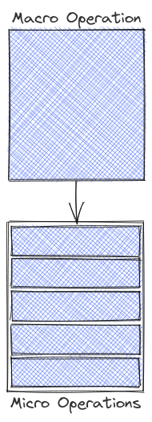
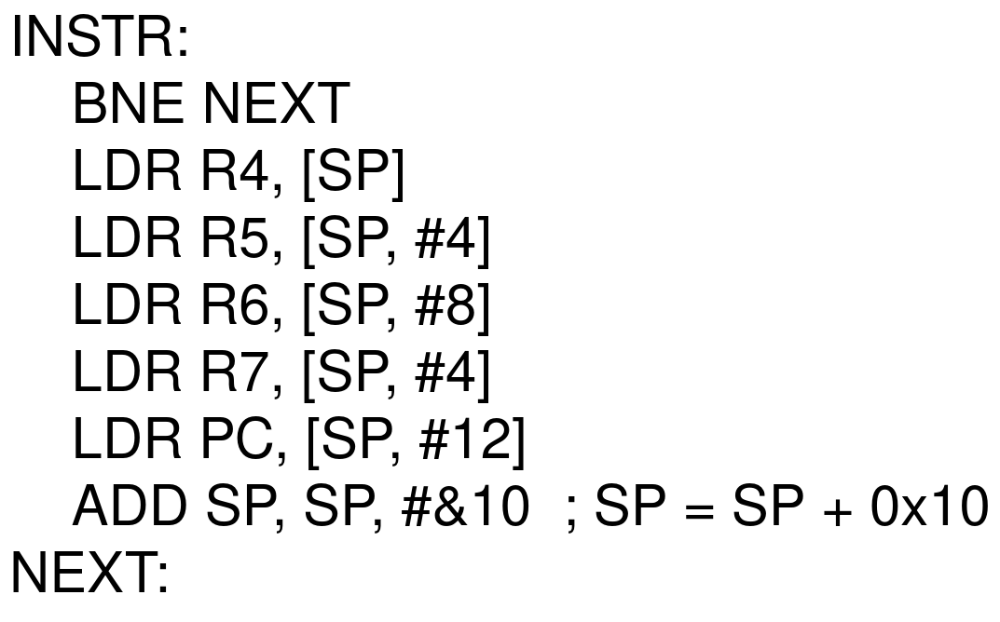

Most **Complex Instruction Set Computer** (CISC) **Instruction Set Architecture** (ISA) are build upon the philosophy - "Do more with less". CISC ISAs often contain instructions, that do more than one operation at once - a single instruction can load data and compute on it. This also means that the circuits handling CISC logic tend to be complicated yet we see industry leaders such as AMD and Intel reach great heights with the x86 ISA which is inherently CISC in nature. Today we'll take a look at the technique that makes this high performance possible and why the lines between **Reduced Instruction Set Computer** (RISC) and **Complex Instruction Set Computer** (CISC) slowly fading.

Alt: A schematic diagram showing how Macro operations are broken down into micro operations.
 
Made with <a href="https://excalidraw.com/" target="_blank">https://excalidraw.com/</a> (link opens a new tab)

# Why CISC?

One might have a question already - Why use CISC ISA? Why not just use RISC ISAs such as ARM and RISC-V?  
The answer is more complicated than it seems:
-  **Software** - Most softwares are compiled targeting a single architecture. Supporting multiple architecture and platforms add the the cost of engineering software. Migrating from one platform to another might also incur additional costs - especially platform specific optimizations.
-  **Better Cache Utilization** - Caches are small, but high speed memory often able to serve data within a couple of clock cycles. If multiple instructions can be replaced by a single instruction that takes up lesser space, more operations can be done with the same amount of Instruction cache compared to a RISC architecture.
-  **Popularity** - Most end user desktops and laptops come with an x86 compatible processor. It makes more sense to target an architecture that more people will use. Most often than not, it becomes hard to justify supporting platforms that turns out to cost more to maintain than revenue it generates.

Alt: A schematic diagram showing how Macro operations are broken down into micro operations.
 
Made with <a href="https://excalidraw.com/" target="_blank">https://excalidraw.com/</a> (link opens a new tab)

Now that we know replacing CISC with RISC is an expensive venture, let us look at the secret behind high performance RISC pipelines.

# μOps - Breaking down CISC Instructions

In one of the talks by [Christopher Celio](https://www.linkedin.com/in/christopher-celio-324488b3/) titled [ISA Shootout](https://www.youtube.com/watch?v=Ii_pEXKKYUg), Chris brings up a slide with a seemingly complicated ARMv7 instruction

Alt: A slide from Christopher's talk that shows how LAMIAEQ instruction from the ARMv7 ISA that is capable of performing 6 loads, writes to 7 register and executes them conditionally based on CPU state. In addition to this, the register it writes to can be the Program Counter (PC) which will effectively make the instruction a conditional jump.
 
Source: YouTube video titled <a href="https://www.youtube.com/watch?v=Ii_pEXKKYUg" target="_blank">"Tuesday @ 1130 ISA Shootout – a Comparison of RISC V, ARM, and x86 Chris Celio, UC Berkeley V2"</a> (link opens a new tab)

Chris goes on to say, for ARMv7, which is considered to be one of the RISC ISA, it does contain very CISC like instructions and if we observe the trend, the lines between RISC and CISC have gotten blur over time.  

Now as a CPU architect, one must figure out how to implement this instruction efficiently in the micro-architecture. Turns out, they have a handy trick up their sleeves.

**What if we treat one instruction as several smaller operations (micro-operations)?**

One can then decompose the complicated ARMv7 instruction shown above into following sequence of instructions

Alt: A naive breakdown of the LAMIAEQ instruction mentioned above that might be equivalent (at least it looks the part)
 
Made with <a href="https://excalidraw.com/" target="_blank">https://excalidraw.com/</a> (link opens a new tab)

Once we can reduce the larger instruction into smaller μOps, different avenues of optimizations pop us, the obvious one being Instruction Level Parallelism (ILP) - In case of register file with multiple store ports, multiples stores can be resolved at once further improving performance.

# Complicated Bits

In a modern Out-of-Order (OoO) Processor, the notion of precise interrupts have to be followed irrespective of the wizardry that goes into the micro-architectural implementation. In case the execution of a μOp leads to an interrupt - say an illegal load - the processor should be able to point it back to the original instruction, flush the Reorder Buffer (RoB) and then notify then interrupt the program showing the original instruction lead to the interrupt.

Enabling μOp fission requires changes to the frontend and the Reorder Buffer, both of which is a challenge from an architect's perspective. Despite these challenges, multiple CPU vendors have successfully enabled μOp fission in their offerings enabling the CISC community to benefit from all the advantages of RISC advancements.

Thank you for reading till the end. This post was delayed due to un forseen events in personal life. I'll try to get back to the - one article a week - posting schedule soon. Stay tuned.  
I'm an undergraduate student keenly interested in Computer Architecture and I look at micro-architectural based attacks to understand more about the working of our hardware. If you find any inaccuracies in the above post, please leave a comment and I'll address it in the next edit. Have a nice day!