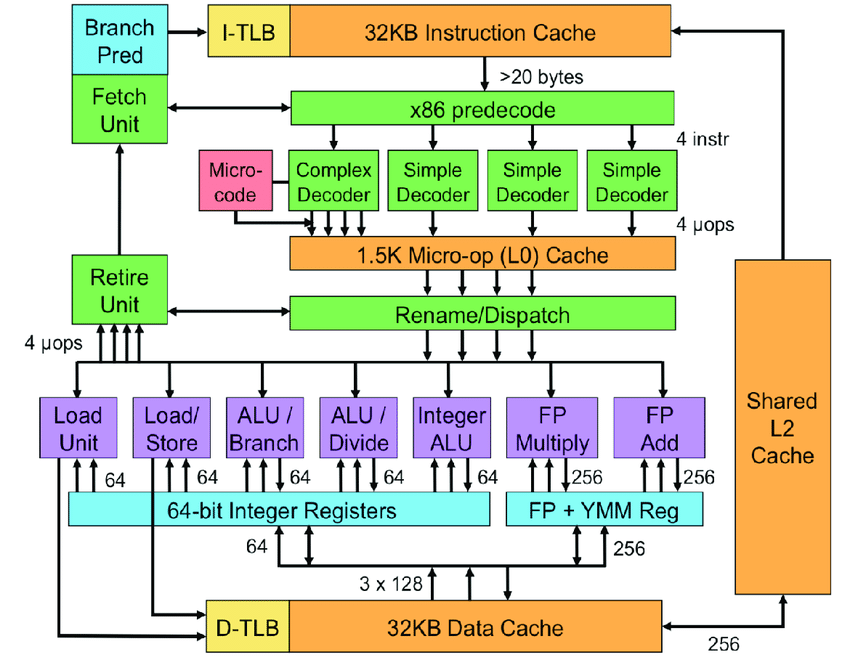
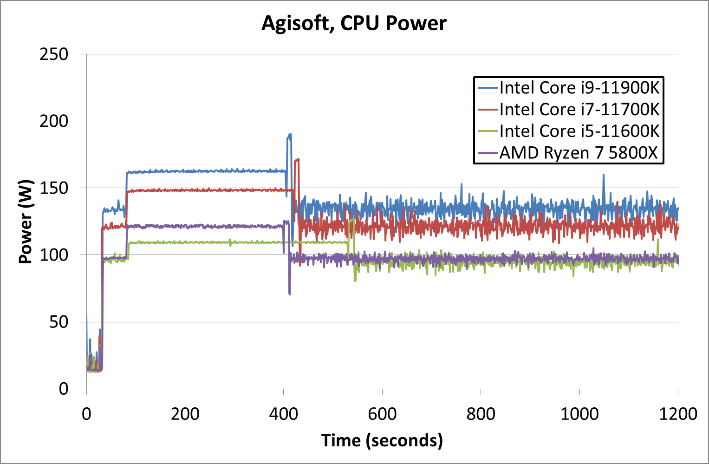
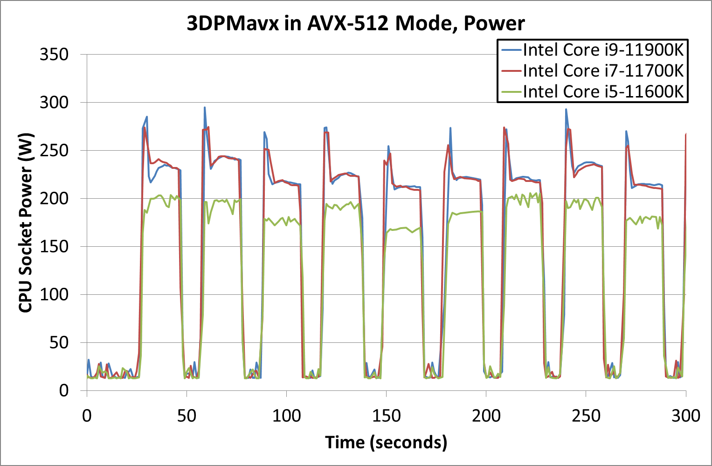

In our last few posts we looked at **Timing Analysis** and techniques such as **Flush and Reload**, and **Prime and Probe** that exploit timing difference to deduce operations of victim.

Looking at Timing Analysis, we observe how we exploit the lack of uniformity within the system to observe the victim. In timing analysis, we exploit the timing difference between loading data from cache and loading data from main memory as a device to observe bits of program victim is executing. If this execution pattern depends on some secret held by the victim, we can infer details about the secret from the patter on execution of victim thread.


<center>
Alt: A lightning icon representing power
<br/>
Source: Icons made by <a href="https://www.freepik.com/" target="_blank">Freepik</a> (link opens a new tab) from <a href="https://www.flaticon.com/" target="_blank">Flaticons</a> (link opens a new tab)
</center>


## Energy and Execution

Modern microprocessors are complex feat with multiple physical cores and multiple different functional unit - Arithmetic and Logic Unit (ALU) to process integers, Floating Point Unit, Single Instruction Multiple Data (SIMD) units such as the ones that operate via AVX Instructions in x86 architecture.

With different circuits having different complexity, they have different power draws. A careful observer with a device that can accurately measure power consumption can deduce information about runtime of victim.


<center>
Alt: Block diagram on Intel Sandy Bridge CPU showing different load store units, ALU units for integers and floating point units.
<br/>
Source (link opens a new tab): <a href="https://www.researchgate.net/figure/Sandy-Bridge-block-diagram_fig1_220308557" target="_blank">https://www.researchgate.net/figure/Sandy-Bridge-block-diagram_fig1_220308557</a>
</center>

 
## Device for leak

The device for significant leaks using power analysis are generally the ones that are dependent on SIMD circuits. Consider an algorithm that calls a SIMD routine based on value of data. For example:

```c
while (secret)
{
        if (secret & 1)
        {
                simd_compute();
        }
        secret = secret >> 1;
}
```
 

Here call to **simd_compute()** is queued to the SIMD unit that can do 4x the computation of a Floating Point unit in same number of cycles. What this also means is that it will consume proportional energy to do so. Thus observing the power draw can give an attacker an insight of the victims runtime and sometimes  even leaking secret data.

 
## How significant is power draw difference?

Using the value measured by Dr. Ian Cutress of AnandTech as reference we can see that a CPU benchmark program that stresses the Single Instruction Single Data (SISD) unit consume not more than 200W


<center>
Alt: Power draw of latest Intel 11th Generation Rocket Lake series running Agisoft, CPU power. The average power draw is close to 150W with peak nearing 200W.
<br/>
Source (link opens a new tab): <a href="https://www.anandtech.com/show/16495/intel-rocket-lake-14nm-review-11900k-11700k-11600k/5" target="_blank">https://www.anandtech.com/show/16495/intel-rocket-lake-14nm-review-11900k-11700k-11600k/5</a>
</center>
<br/>


Compare these numbers to power draw of AVX-512 unit, we see the average close to 250W and a peak close to 300W when the SIMD unit is being used.


<center>
Alt: Power draw of latest Intel 11th Generation Rocket Lake series running 3DPMavx in AVX-512 mode. The average power draw is close to 250W with peak nearing 400W.
<br/>
Source (link opens a new tab): <a href="https://www.anandtech.com/show/16495/intel-rocket-lake-14nm-review-11900k-11700k-11600k/5" target="_blank">https://www.anandtech.com/show/16495/intel-rocket-lake-14nm-review-11900k-11700k-11600k/5</a>
</center>
<br/>


As we see there is indeed a significant difference in the power draw between a normal workload and workload that depends on SIMD processing.


### Complications

The following are the complications to power analysis:

- Attacker must be able to accurately observe and record power draw of the CPU.
- In some systems, power draw of entire system might not capture CPU state due to presence of other computation hardware.
- Careful analysis needs to be performed on power draw data infer correct results. 


We can see, as a result of the non-uniformity in power consumption by different units of CPU, the power consumption becomes a side-channel to extract information from the unsuspecting system.

 
## Coming up next

We'll take a brief detour from Power Analysis and look at other exploits and emerging memory architecture but we'll come back to power analysis to see a real world exploit based on the concepts discussed here.
 

Thank you for reading till the end. I'm an undergraduate student keenly interested in Computer Architecture and I look at micro-architectural based attacks to understand more about the working of our hardware. If you find any inaccuracies in the above post, please leave a comment and I'll address it in the next edit. Have a nice day! 