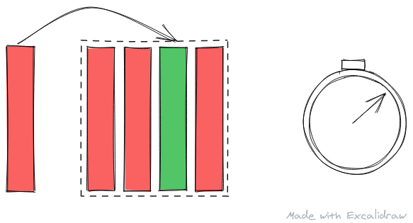
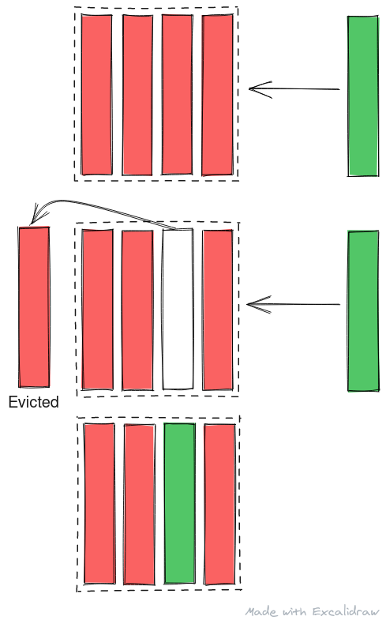
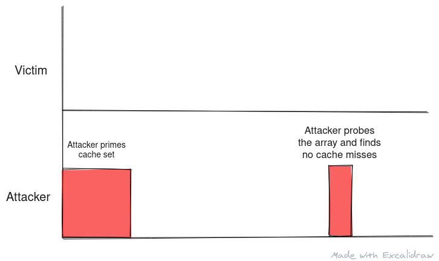
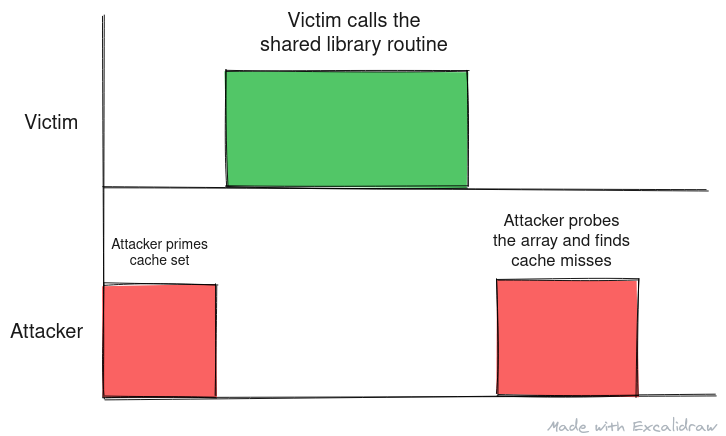

This is the third post in our series of Timing Analysis and I high recommend reading the first two posts - <a href="/timing-analysis" target="_blank">Timing Analysis</a> (link opens a new tab), and <a href="/flush-and-reload" target="_blank">Flush and Reload</a> (link opens a new tab). That said if you are aware about cache hierarchy, shared libraries, shared pages, and cache placement policies, you can continue reading this article.

In this post we look at **Prime and Probe**.

Alt: An illustration of prime and probe
 
Made with <a href="https://excalidraw.com/" target="_blank">https://excalidraw.com/</a> (link opens a new tab)

## Cache Replacement Strategies

The placement of data in cache is discussed briefly in Flush and Reload post. Here we will take a look at how data is replaced in cache. There are many different strategies to evict data from cache when a new data is needed to be stored in a filled cache set. Some of them are (some more practical than others):

- **First In First Out (FIFO)** - The logic behind the First In First Out is that the data that came first is probably the one that won't be used again for long time and hence need not be cached.
- **Last In First Out (LIFO)** - The logic behind Last In First Out policy is that the data used last will not be used again for a while and in case of spacial locality the first data will be fetched first and that will lead to a cache hit.
- **Least Recently Used (LRU)** - The data that hasn't been accessed for the longest will be evicted. This policy uses past access as a metric to predict future.

To know more about cache replacement, you can read the Wikipedia article titled <a href="https://en.wikipedia.org/wiki/Cache_replacement_policies" target="_blank">Cache Replacement Policy</a> (link opens a new tab).

The main takeaway from this section, to understand prime and probe, is that whenever cache set is filled, some data is evicted from the cache set to make room for the new data.

Alt: A depiction of cache replacement where when a new data arrives at a populated cache set, data from a particular cache line is evicted based on the cache replacement algorithm and the new data is filled in.
 
Made with <a href="https://excalidraw.com/" target="_blank">https://excalidraw.com/</a> (link opens a new tab)

## Prime and Probe

In prime and probe, the attacker threads fills the cache set where the shared library routine will be loaded. As cache placement is deterministic based on the address of the data being loaded, attacker can fill a cache set very easily with junk data.Once filled, the attacker its and tries to read this data again. If he can access all the data quickly, they are still in cache and the shared routine must not have run since cache was last primed. If one data access takes longer that other, the data has been evicted from the cache and the shared library routine might have run since cache was last primed.

Thus the attacker can prime the cache set with his data and probe it at regular interval timing the accesses. The advantage of prime and probe over flush and reload is that we don't depend on the micro-architecture to have implemented an instruction like clflush and we use the design and behavior of cache to spy on victim. With prime and probe, the probe in fact primes the cache for the next analysis as reading data will cause the data to be cached again but priming cache initially takes longer.

Alt: A step by step look at how prime and probe works on a blocking cache - the data from victim thread evicts the data from cache primed by the attacker. When the attacker probes the data, the he finds cache misses and following an LRU replacement scheme, the victim data becomes the least recently used data and is evicted at the end after all the probing thus priming the cache set again for next round.
 
Made with <a href="https://excalidraw.com/" target="_blank">https://excalidraw.com/</a> (link opens a new tab)

 

**Note**: The diagram depicts a blocking cache where only one outstanding request to cache can exist. In modern microprocessors, the caches are asynchronous and the LRU counter is updated dynamically. The end result is however the same - if victim doesn't calls the shared routine again in middle of probing, it becomes the lease recently used data as it was brought in before the probing began and will be the one to get evicted.

How secrets can be leaked using shared memory access is discussed in the previous article of this series titled Flush and Reload but the basic gist behind the leak is if the call to shared library routine is based on a secret in the victim thread, the attacker can infer information about the secret and can, in some cases, discover what the secret is entirely.

## Complications

Prime and Probe have the following complications associated with it:

- The attacker and victim should run on the same physical core on separate threads at the same time.
- The attacker and victim should share the last level cache. Without shared cache, this type of attack will not work.
- Probing the data takes some time and the victim thread must not make a call to the shared library routine in middle of probing else based on cache replacement strategies, the cache set might not be primed in the end,

### Scenarios

The following images depict the optimal scenario for prime and probe:

Alt: The attacker thread primes the cache and finds no cache miss in next probe thus deducing that victim didn't call the shared library routine.

Alt: The attacker thread primes the cache. The victim thread loads the shared library routine evicting some data from cache set. The attackers finds a cache miss in next probe thus deducing that victim called the shared library routine.

 
 

The following scenarios show where the attacker can misinterpret data if they fail to plan the timing between prime and successive probes:

Alt: The attacker thread primes the cache. The victim thread loads the shared library routine evicting some data from cache set. The routine is run again in victim before the probing as a result of poor timing. The attackers finds a cache miss in next probe thus deducing that victim called the shared library routine once when in fact it ran twice.

![The attacker thread primes the cache. The attacker probes before data for the shared routine could be loaded into cache thus detecting no cache miss deducing that shared library has not been run when in fact it is being loaded concurrently. The victim thread loads the shared library routine evicting some data from cache set. The routine is run again in victim before the probing as a result of poor timing. The attackers finds a cache miss in next probe thus deducing that victim called the shared library routine once when in fact it ran twice.](./4.png)

Alt: The attacker thread primes the cache. The attacker probes before data for the shared routine could be loaded into cache thus detecting no cache miss deducing that shared library has not been run when in fact it is being loaded concurrently. The victim thread loads the shared library routine evicting some data from cache set. The routine is run again in victim before the probing as a result of poor timing. The attackers finds a cache miss in next probe thus deducing that victim called the shared library routine once when in fact it ran twice.
 
Made with <a href="https://excalidraw.com/" target="_blank">https://excalidraw.com/</a> (link opens a new tab)

## Coming up next

In the next post we'll look at other side channels which exist in modern processors and attacks that use these channels effectively to leak secrets in real world application.
 

Thank you for reading till the end. I'm an undergraduate student keenly interested in Computer Architecture and I look at micro-architectural based attacks to understand more about the working of our hardware. If you find any inaccuracies in the above post, please reach out to me and I'll address it in the next edit. Have a nice day!