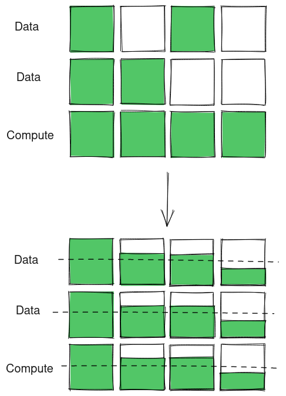
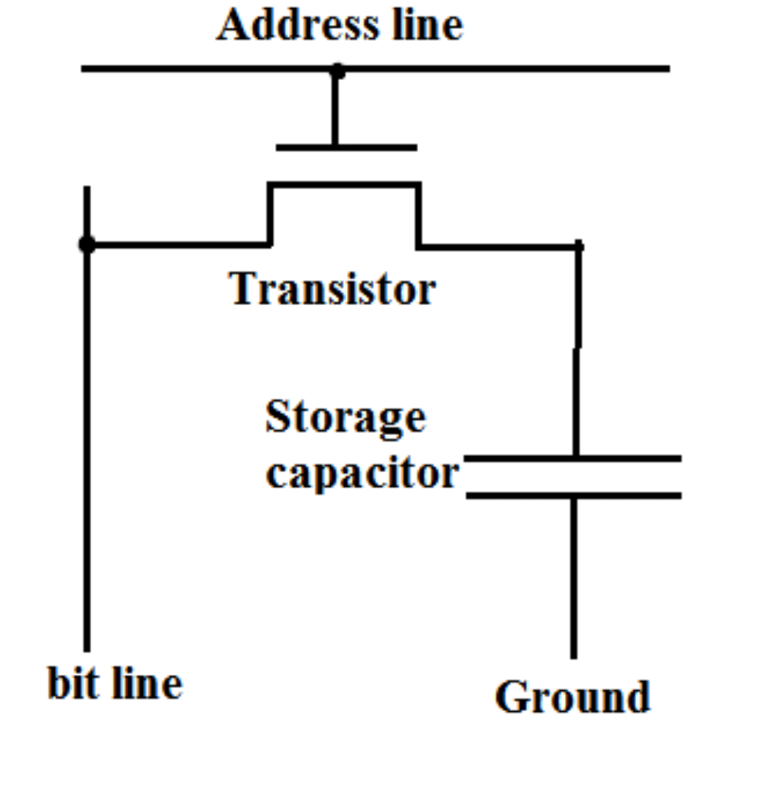

Today we will discuss the concept put forward by an amazing paper titled:

<center>
<a href="https://www.microsoft.com/en-us/research/wp-content/uploads/2017/09/MICRO-50_347.pdf" target="_blank">
V. Seshadri et al.,
<br/>
"Ambit: In-Memory Accelerator for Bulk Bitwise Operations Using Commodity DRAM Technology,"
<br/>50th Annual IEEE/ACM International Symposium on Microarchitecture (MICRO), 2017
<br/>
</a>
(link opens a new tab with pdf ~ 2.6MB)
<br/>
IEEE Page (link opens a new tab): <a href="https://ieeexplore.ieee.org/document/8686556" target="_blank">https://ieeexplore.ieee.org/document/8686556</a>
</center>
<br/>


This post takes a brief look at the concept however the paper goes in depth reasoning the approach and ways to realize it in commodity hardware. I highly recommend reading the paper if you would like to learn more about the mechanism that enables this compute in DRAM. If you like a higher bandwidth medium like video, you can find the more recent talk by Nastaran Hajinazar about <a href="https://youtu.be/lu3Br4-kySw" target="_blank">SIMDRAM on Youtube</a> (link opens a new tab) that talks about the entire system right from programming interface and Instruction Set Architecture to realizing the mechanism in hardware in their talk and their paper.


<center>
Alt: A diagram showing OR operation with Processing in memory where two data rows are opened together with a fully charged compute row to effectively perform an OR operation.
<br/>
Made with <a href="https://excalidraw.com/" target="_blank">https://excalidraw.com/</a> (link opens a new tab)
</center>


## DRAM Cell Design

A DRAM cell consists of two parts - a storage capacitor and a transistor. The capacitor stores the charge and transistor guards the access to charge. These cells are arranged in form of an array and the data is accessed using a address line and a bit line - the address line activates a particular row and the bit line carries the charge fro the particular cell it is connected to.


<center>
Alt: The diagram shows the structure of a DRAM cell with a storage capacitor and a transistor. When the transistor is activated using address line, the charge from capacitor flows into the bit line and can be stored or read.
<br/>
Source (link opens a new tab): <a href="https://electronics.stackexchange.com/questions/306002/why-does-a-dram-cell-necessarily-contain-a-capacitor" target="_blank">https://electronics.stackexchange.com/questions/306002/why-does-a-dram-cell-necessarily-contain-a-capacitor</a>
</center>
<br/>

The gate connected to the address line restricts the flow of charge from capacitor into bit line. When the transistor is activated via the address line, the charge flows into the bit line and we can see if capacitor is charged signifying 1 or uncharged signifying 0.

The charge dissipates from the capacitor eventually and hence the capacitor is recharged periodically to preserve the correct state. If the level is over half, the capacitor is charged to show 1 and if it is below half, the capacitor is discharged to signify 0.

 
## Charges and Equilibrium

When two bodies are connected by a physical medium such as wire and they have a potential difference, the charges from one body to another until a equilibrium is reached.


<center>
Alt: A depiction of how unbalanced charges reach equilibrium once connected by a wire.
<br/>
Made with <a href="https://excalidraw.com/" target="_blank">https://excalidraw.com/</a> (link opens a new tab)
</center>
<br/>


Once reached equilibrium, the charge level remains same between both bodies. If n bodies with charge q and y uncharged bodies are connected to each other, the final equilibrium state will be reached with all bodies with a charge of

```r
q (final) = (n * q) / (n + y)
```

So if one charged body with charge q is connected to 2 uncharged body, the final equilibrium is reached with each body having a `charge = q * (1 / 3)`


## Computation in DRAM

Let us look at the working of Compute DRAM. In Compute DRAM, data to be operated on are brought into data rows. A compute / operation row is pre-charged based on the operation. All rows are opened at once for charges to balance and finally the compute row is recharged to reveal the output of computation.

### Bitwise OR

Consider the following example for bitwise OR:


<center>
Alt: The diagram above shows Compute DRAM operation for bitwise OR. The data is loaded into data rows and he compute row is pre-charged. Once opened, the charges balance as follows: for data cells with 1 and 1, the charge equalizes to 1, for data cells with 0 and 1 or 1 and 0, the charges equalizes to 2/3 and for data cells with 0 and 0 the charges equalizes to 1/3. On recharging the compute row, the 1 stays 1, the 2/3 is brought up to 1 and 1/3 is brought down to 0 effectively giving bitwise OR.
<br/>
Made with <a href="https://excalidraw.com/" target="_blank">https://excalidraw.com/</a> (link opens a new tab)
</center>


### Bitwise AND

The following example is for bitwise AND:


<center>
Alt: The diagram above shows Compute DRAM operation for bitwise AND. The data is loaded into data rows and he compute row is uncharged. Once opened, the charges balance as follows: for data cells with 1 and 1, the charge equalizes to 2/3, for data cells with 0 and 1 or 1 and 0, the charges equalizes to 1/3 and for data cells with 0 and 0 the charges equalizes to 0. On recharging the compute row, the 2/3 is brought up to 1, 1/3 is brought down to 0, and 0 stays at 0, effectively giving bitwise AND.
<br/>
Made with <a href="https://excalidraw.com/" target="_blank">https://excalidraw.com/</a> (link opens a new tab)
</center>
<br/>


This is how Compute DRAM realize bitwise OR and BITWISE and but the paper goes into details or realizing more complex logic. I highly recommend reading the paper or even watching the video on Computer System for Processing Using Memory by Nastaran Hajinazar linked at the top of this post.

 
## Why "Processing using Memory"?

As memory becomes a bottleneck and moving data becomes expensive in terms of energy, paradigms like Processing in Memory and Processing using Memory are gaining popularity among researchers to see whether novel ideas like In DRAM Processing can pave the way forward for a new avenue in computer architecture to extract more performance and influence the design of future general purpose hardware.

Future seems bright for the architects as things are taking hard turn for the better.


Thank you for reading till the end. I'm an undergraduate student keenly interested in Computer Architecture and I look at micro-architectural based attacks to understand more about the working of our hardware. If you find any inaccuracies in the above post, please leave a comment and I'll address it in the next edit. Have a nice day!

**Edit:** Fixed some typographical errors pointed out by reader Samyak (<a href="https://github.com/Samyak2" target="_blank">Github</a>, <a href="https://twitter.com/Samyak210" target="_blank">Twitter</a>) (link opens Samyak's profile on respective platform in a new tab)