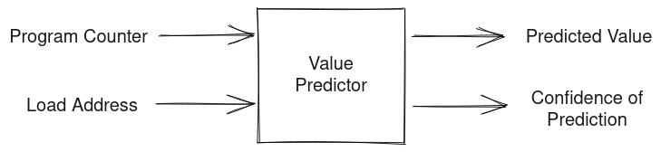

This post is based on the attack covered in the paper:

<center>
<a href="https://mdsattacks.com/files/ridl.pdf" target="_blank">
Stephan van Schaik, Alyssa Milburn, Sebastian Österlund, Pietro Frigo, Giorgi Maisuradze, Kaveh Razavi, Herbert Bos, and Cristiano Giuffrida. 2019.
<br/>"RIDL:Rogue In-flight Data Load". In S&P.
<br/>
</a>
(Link opens a new tab with PDF ~ 2.2MB)
<br/>
Source (link opens a new tab): <a href="https://mdsattacks.com/" target="_blank">https://mdsattacks.com/</a>
</center>
<br />


This post covers the attack is brief however I recommend reading the paper to get the full insight about the attack and various little details that made the exploit possible.


<center>
Alt: An illustrative diagram of RIDL where data is wrongly forwarded based on speculation
<br/>
Made with <a href="https://excalidraw.com/" target="_blank">https://excalidraw.com/</a> (link opens a new tab)
</center>


## Value Prediction

As an aggressive method to increase Instruction Level Parallelism, modern processors have started speculating on value for a particular long latency cache miss using the program counter and the data address. There are competitions around value prediction - most notable one being the <a href="https://www.microarch.org/cvp1/cvp1online/contestants.html" target="_blank">Championship Value Prediction (CVP)</a> (link opens a new tab) where competitors try to predict value for loads for varying storage budget. André Seznec, the branch prediction ninja as also the winner of the first CVP competition for all the storage budget - 8KB, 32KB and Unlimited Storage (the last was a join effort by André Seznec and his colleague Kleovoulos Kalaitzidis, both working in IRISA/INRIA at the time of the championship).



<center>
Alt: A schematic of a value predictor that takes the value of Program Counter and Load Address to predict a value and also output a confidence for the predicted value being right.
<br/>
Made with <a href="https://excalidraw.com/" target="_blank">https://excalidraw.com/</a> (link opens a new tab)
</center>
<br/>

Although modern processors don't have buffers dedicated to hold the history of loads and complex prediction units, what they do try to do is predicatively forward data in store buffer and line fill buffer to outstanding loads.

 
## Line Fill Buffers

Line fill buffers are structure on top of caches that is used to optimize loads and stores - in case of multiple loads to same address, it squashes the loads into a single request and broadcasts the data back on arrival. In case of outstanding stores to same address, line fill buffer overwrites the old value and sends a single store request. Line fill buffer also requests and stores data that bypasses entire cache hierarchy - data that won't be used soon or is sensitive in nature, and need not be cached.

 

<center>
Alt: A diagram showing how line fill buffer squashes loads to same address and writes only the most recent value to the address with multiple outstanding store.
<br/>
Made with <a href="https://excalidraw.com/" target="_blank">https://excalidraw.com/</a> (link opens a new tab)
</center>

 
## Speculative Forwarding

In speculative forwarding, the store buffer and line fill buffer try to match the lower bits of address with the outstanding stores and if and when a match is found, speculatively forward the data to the process. This being speculative state, has no impact on the correctness of program in case of mis-prediction where the pipeline is flushed and restarted from the point of speculation. What this doesn't take into account is the micro-architectural traces it leaves behind in cache that can be surfaced using timing analysis.


<center>
Alt: A schematic that shows how processors speculate two addresses might me same based on just the lower bits
<br/>
Made with <a href="https://excalidraw.com/" target="_blank">https://excalidraw.com/</a> (link opens a new tab)
</center>
<br/>

**Note**: In reality, the speculation uses lot more lower bits than shown above but the concept remains the same.


## Rogue In-Flight Data Load (RIDL)

In RIDL, the attacker can extract secrets from line fill buffer in a way similar to that of the meltdown attack. Consider the following code:

 
```c
unsigned char device[4096 * 16];
unsigned int *ptr;
device[(*ptr & 15) * 4096];
```


Let ptr be any valid pointer in attacker's user space. Assume value at address pointed by ptr is 2. If we run the following code ensuring device is not cached and perform a timing analysis, we might find an anomaly as such:


<center>
Alt: A diagram that shows timing analysis for array access. It is observed that not only data at address 2 * 4096 (which is expected given data pointed by ptr is 2) is cached but also data at 8 * 4096
<br/>
Made with <a href="https://excalidraw.com/" target="_blank">https://excalidraw.com/</a> (link opens a new tab)
</center>
<br/>


**Note**: The index is scaled by a factor of 4096 as to prevent anomalies due to hardware prefetcher bringing neighboring pages into the cache.

We observe two addresses being cached however we expected only one of them to be cached. The second value is a result of processor speculatively forwarding the value from line fill buffer whose address have the same corresponding lower bits that of address in ptr.

 
## Exploits

RIDL is hard to exploit as data in line fill buffer only stays there for a small time and attacker has a very small window to read the data. In the exploit outlined in paper, the attacker can only manage to read some bytes per day from a victim that is continuously loading same data in a loop. However we see, such an attack is possible and speculation can have an adverse side effects often leaking states via microarchitectural side channels which otherwise shouldn't be accessible to the user.

Again I urge the readers to go through the paper to understand the intricacies of the exploit. The RIDL paper also does a great job explaining the microarchitectural implementations in Intel processors which is wonderful.


Thank you for reading till the end. I'm an undergraduate student keenly interested in Computer Architecture and I look at micro-architectural based attacks to understand more about the working of our hardware. If you find any inaccuracies in the above post, please leave a comment and I'll address it in the next edit. Have a nice day!
