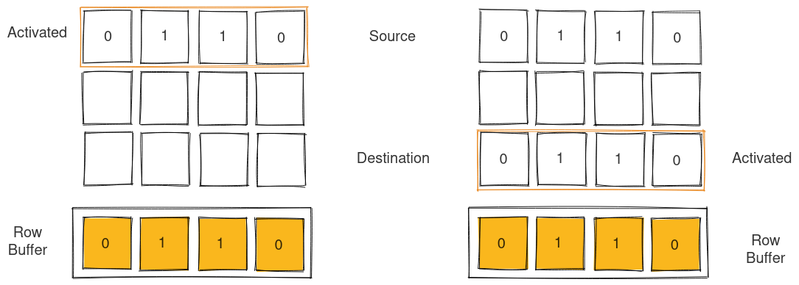
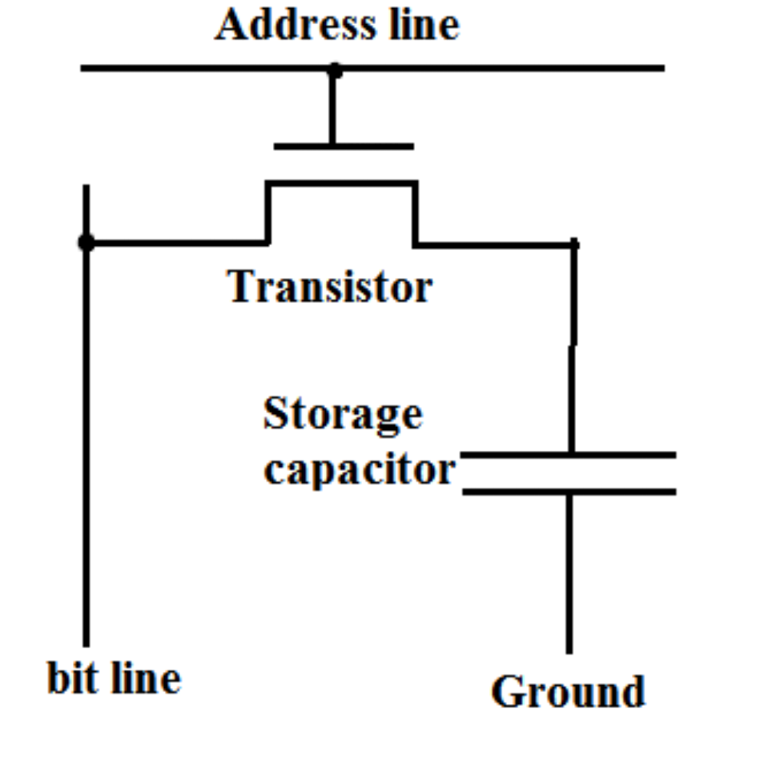
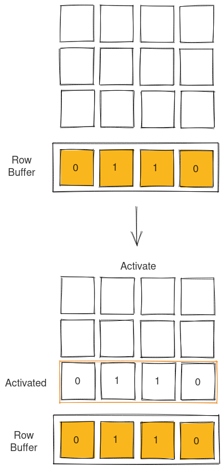

In this post, we'll take a brief look at the paper:

<a href="https://users.ece.cmu.edu/~omutlu/pub/rowclone_micro13.pdf" target="_blank">
V. Seshadri et al.,
 
"RowClone: Fast and energy-efficient in-DRAM bulk data copy and initialization,"
 
46th Annual IEEE/ACM International Symposium on Microarchitecture (MICRO), 2013
 
</a>
(Link opens a new tab with PDF ~ 2.4MB)
 
IEEE Page (link opens a new tab): <a href="https://ieeexplore.ieee.org/document/7847625" target="_blank">https://ieeexplore.ieee.org/document/7847625</a>

 

This post only takes a brief look at the concept described in the paper and I highly encourage you all to go through the paper to know more about the concept and the underlying mechanism that enables RowClone.

Alt: A diagram that illustrates RowClone that uses to back to back activates to clone data from one DRAM row to another using the Row Buffer
 
Made with <a href="https://excalidraw.com/" target="_blank">https://excalidraw.com/</a> (link opens a new tab)

## Structure of DRAM

If you have read my previous posts on Processing using Memory or Row Hammer, you can skip this section. For those who are new to the blog or are interested in a quick refresh, let us briefly look at structure of DRAM.

A DRAM mainly consists of a Transistor and Capacitor connected as depicted in diagram below. When a high voltage is applied to the word line (also known as address line), the transistor is active and the charge in the capacitor can be read from the bit line. The capacitor leaks charge over time and hence it is recharged periodically.

Alt: The diagram shows the structure of a DRAM cell with a storage capacitor and a transistor. When the transistor is activated using address line, the charge from capacitor flows into the bit line and can be stored or read.
 
Source (link opens a new tab): <a href="https://electronics.stackexchange.com/questions/306002/why-does-a-dram-cell-necessarily-contain-a-capacitor" target="_blank">https://electronics.stackexchange.com/questions/306002/why-does-a-dram-cell-necessarily-contain-a-capacitor</a>

 

These cells are arranged into a 2D grid. The bottom row of the grid is know as the Row Buffer. The Row Buffer stores the data from the the activated row that is later consumed. If data to be accessed is present in the Row Buffer, it is termed as a Row Buffer hit and the row activate can be avoided. Each DRAM module contains multiple banks that can work independently and each bank contains its own Row Buffer.

Alt: The image above shows how a DRAM module contains multiple banks capable of operating independently. Each bank consists a grid of DRAM cell with the Row Buffer as the last row. The DRAM cell itself consists of a Transistor and Capacitor. On applying a high voltage across the word line / address line, the data from the particular row is transferred to the Row Buffer and the data can be accessed from the Row Buffer.
 
Source (link opens a new tab): <a href="https://www.researchgate.net/figure/Simplified-topology-of-DRAM-organization_fig1_326276966" target="_blank">https://www.researchgate.net/figure/Simplified-topology-of-DRAM-organization_fig1_326276966</a>

 

Now that we know, each row activate brings data into the Row Buffer, we can dive deeper into the mechanism of the RowClone.

## Storing Data in DRAM Row

Just as one can open a row to transfer charges onto the DRAM Row Buffer, one can also open an empty row to transfer charge from the DRAM Row Buffer to the DRAM cells of the activated row. Once charges stabilize, the cells with charged capacitor can be charged completely to denote a binary 1 and the cells that are uncharged stay the same to denote a binary 0.

Alt: An illustration that depicts how the binary data 0110 in the DRAM row buffer is transferred to the the destination row by activating the destination row and waiting for charges to stabilize.
 
Made with <a href="https://excalidraw.com/" target="_blank">https://excalidraw.com/</a> (link opens a new tab)

 

Now that we know how to put data back into the DRAM row, let us look into RowClone.

## RowClone

In RowClone, the source and destination rows are activated one after the other. The Row Buffer acts as an intermediary for the data transfer. The data gets placed in the Row Buffer and then read back from it into the destination.

Alt: The above diagram illustrates RowClone. The first activate of source row brings the data 0110 stored in the source row into the Row Buffer. The second activate of the destination row transfers the data from the Row Buffer to the destination row completing the cloning of row.
 
Made with <a href="https://excalidraw.com/" target="_blank">https://excalidraw.com/</a> (link opens a new tab)

## Advantages of Row Clone

There are numerous advantages of RowClone:

- RowClone takes a small fraction of energy required to clone data compared to traditional CPU centered approaches.
- RowClone is very fast compared to CPU centered approaches as data doesn't leave the DRAM module.
- RowClone prevents cache pollution by not bringing in data to CPU thus keeping  

The authors later went on to publish more papers that solved efficiency issues related to data transfer between different banks that would have otherwise used the data bus and consumed more power.

RowClone gives an different perspective at processing similar to Processing using Memory - instead of centering processing around CPU, we can move processing near data to save time and energy and as our focus shifts to making more energy efficient and data centric architectures to counter slowing down of Moore's Law.

Thank you for reading till the end. I'm an undergraduate student keenly interested in Computer Architecture and I look at micro-architectural based attacks to understand more about the working of our hardware. If you find any inaccuracies in the above post, please leave a comment and I'll address it in the next edit. Have a nice day!