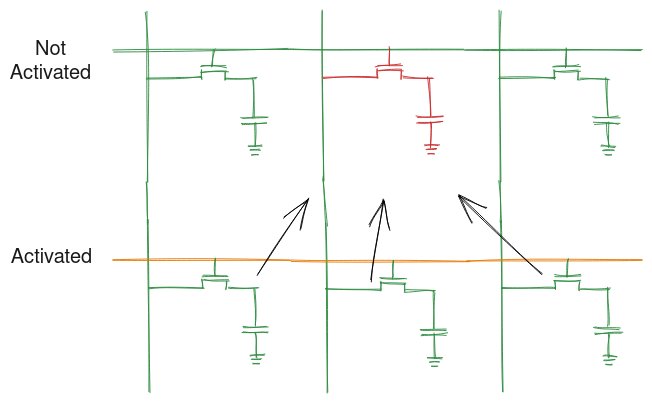
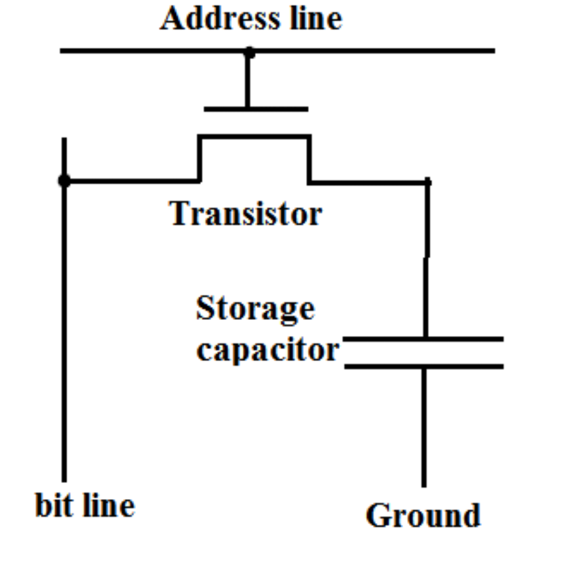
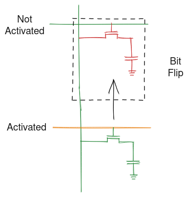
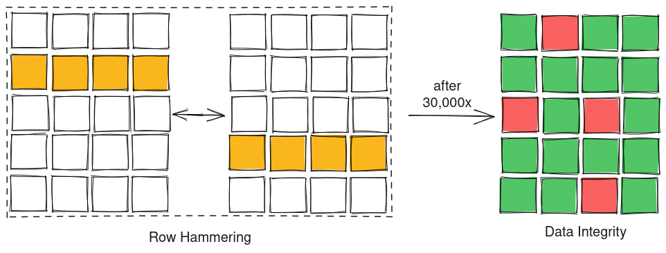

This post we'll take a look at Row Hammer, a read disturbance phenomenon observed in commodity DRAM, first unearthed in the paper:

<a href="https://users.ece.cmu.edu/~yoonguk/papers/kim-isca14.pdf" target="_blank">
Y. Kim et al.,
 
"Flipping bits in memory without accessing them: An experimental study of DRAM disturbance errors,"
 
2014 ACM/IEEE 41st International Symposium on Computer Architecture (ISCA '14)
 
</a>
(Link opens a new tab with PDF ~ 828KB)
 
IEEE Page (link opens a new tab): <a href="https://ieeexplore.ieee.org/document/6853210" target="_blank">https://ieeexplore.ieee.org/document/6853210</a>

 

In this post I'll only betaking a brief look at the issue and I highly encourage you all to read the paper to find more insights and nitty gritty details of this vulnerability.

Alt: An illustration of Row Hammer showing how an activate of one row can influence the data stored in the adjacent row.
 
Made with <a href="https://excalidraw.com/" target="_blank">https://excalidraw.com/</a> (link opens a new tab)

 
## Structure of DRAM

To fully understand the vulnerability, we must first take a look at the how modern DRAM are structured.

All digital data can be represented using binary bits - 0 or 1. Storing these bits in their meaningful order to retrieve back again forms the crux of storage systems. In DRAM, these bits are stored as charges in cells consisting of a transistor and a capacitor. as shown below:

Alt: The diagram shows the structure of a DRAM cell with a storage capacitor and a transistor. When the transistor is activated using address line, the charge from capacitor flows into the bit line and can be stored or read.
 
Source (link opens a new tab): <a href="https://electronics.stackexchange.com/questions/306002/why-does-a-dram-cell-necessarily-contain-a-capacitor" target="_blank">https://electronics.stackexchange.com/questions/306002/why-does-a-dram-cell-necessarily-contain-a-capacitor</a>

 

The cells leak charge over time and hence they are recharged periodically to retain the data they hold.

A single bit is rarely ever accessed at once and hence these cells are arranged into a 2D grid with each row connected to the same word line. When data needs to be accessed from a particular row, the word line is used to enable the row and the data of the row can be sampled from the bit lines aka the digit lines. These rows typically consist of 4096 cells to match the page size of most operating system and maximize performance. A row buffer is at the end of the word line to store data before it is put on the bus. In case of data access to same row, data can be read directly from the row buffer and this is called a row buffer hit, analogous to cache hit.

Alt: The diagram shows the structure of a DRAM grid with multiple rows consisting of cells connected to the same word line. The bit line is used to sample the data that runs across the image. (In the image, the columns are actually DRAM rows connected by the same word lines (WL) and the rows are in fact the DRAM columns across which digit lines (DL) are connected)
Source (link opens a new tab): <a href="https://www.cse.scu.edu/~tschwarz/coen180/LN/DRAM.html" target="_blank">https://www.cse.scu.edu/~tschwarz/coen180/LN/DRAM.html</a>

 

At this point you can understand where the "Row" in "Row Hammer" comes from.

## Read Disturbance

Whenever we read from the row, we apply a high voltage to the word line. The data from the activated row is then transferred to row buffer. When we illustrate these cells, they look large but in reality they are so small, their size is measured in nano meters. When components are placed far away, it is rare that one components influences the other but as we try to move to smaller processes to manufacture these and develop strategies to pack them densely, these component can end up influencing one another.

When a high voltage is applied to a row, the electrical disturbance caused to the cell by this sudden activation can influence the cells nearby. These are not new phenomenon and can also be found in Flash Memory but they implement error correction, adding redundancy, to mitigate these problems. In commercial DRAM, this was never a problem before and hence there were no mechanism placed to mitigate these problems.

Alt: An illustration of how an activate of one cell can cause disturbance to flip bit in the cell of an adjacent row.
 
Made with <a href="https://excalidraw.com/" target="_blank">https://excalidraw.com/</a> (link opens a new tab)

 
 

A thing to note is this disturbance is not caused as a result of single read but as a result of continuous activation.

 
## Piecing Together Row Hammer

Now we know the fundamentals behind row hammer, let us see how the authors of the paper executed it.

The authors rapidly activated two rows, with a single row gap in middle, alternatively to see how the data in adjacent cells change. Alternate activates were used as opposed to hammering a single row as the existence of the row data in the row buffer will lead to row buffer hit and the row will not get activated. Accessing the row alternatively makes sure that the data is not present in the row buffer.

The authors observed when repeating this tens of thousands of time will eventually cause data corruption in the adjacent cells.

Alt: An illustration of how hammering alternate rows for tens of thousands of time will lead to data corruption in the DRAM array.
 
Made with <a href="https://excalidraw.com/" target="_blank">https://excalidraw.com/</a> (link opens a new tab)

 

This data corruption patter is random and doesn't link to any particular cell to be averted just by profiling the DRAM module.

## Severity of the Vulnerability

Integrity of the data is the sole reason behind deterministic functioning of our computer. Row Hammer proves that just accessing memory in a certain way can lead to data corruption and this can be exploited in various ways. The smart folks working at Google Project Zero devised a way to exploit the Row Hammer bug to get write access to the Page Table of a system essentially giving complete access of the system to the attacker. You can read more about it here (link opens a new tab): <a href="https://googleprojectzero.blogspot.com/2015/03/exploiting-dram-rowhammer-bug-to-gain.html" target="_blank">https://googleprojectzero.blogspot.com/2015/03/exploiting-dram-rowhammer-bug-to-gain.html</a>

## Mitigation

Some of the mitigation proposed include, but not limited to, decrease time between DRAM refresh at cost of power consumption, profile memory access to prevent DRAM Row Hammer, build a larger reliable cache in DRAM to prevent rapid row activation. DRAM manufacturers implemented Targeted Row Refresh using an proprietary mechanism but the paper **"TRRespass: Exploiting the Many Sides of Target Row Refresh"** [<a href="https://ieeexplore.ieee.org/abstract/document/9152631/" target="_blank">IEEE post</a>, <a href="https://download.vusec.net/papers/trrespass_sp20.pdf" target="_blank">PDF</a> ~ 817KB] (link opens a new tab) reverse engineered the mechanism and showed ways of exploiting Targeted Row Refresh to induce Row Hammer vulnerability in DRAM module. There are publications such as **"BlockHammer: Preventing RowHammer at Low Cost by Blacklisting Rapidly-Accessed DRAM Rows"** [<a href="https://ieeexplore.ieee.org/document/9407238/" target="_blank">IEEE post</a>, <a href="https://arxiv.org/pdf/2102.05981.pdf" target="_blank">PDF</a> ~ 2.2MB] (link opens a new tab) that looks at preventing Row Hammer using open research and hopefully one day we get to a fundamental solution to this problem.

Thank you for reading till the end. I'm an undergraduate student keenly interested in Computer Architecture and I look at micro-architectural based attacks to understand more about the working of our hardware. If you find any inaccuracies in the above post, please leave a comment and I'll address it in the next edit. Have a nice day!