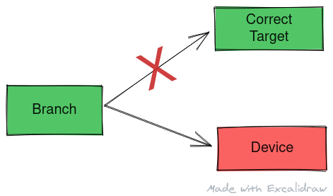

This article is based on the paper

<center>
<a href="" target="_blank">
Kocher, P., Horn, J., Fogh, A., Genkin, D., Gruss, D., Haas, W., Hamburg,M., Lipp, M., Mangard, S., Prescher, T., Schwarz, M., and Yarom, Y.
<br />
"Spectreattacks: Exploiting speculative execution". In S&P(2019)
</a>
<br/>
(link opens a new tab with PDF ~ 294kB)
<br/>
<a href="" target="_blank">
Source (link opens a new tab): https://meltdownattack.com
</a>
</center>
<br/>

In this article we'll take a brief look at Spectre attack however I highly recommend reading the paper mentioned above that goes into more depth about the cause and methods of exploit.

Spectre attacks are of two variants. The first one is similar to Meltdown that exploits out of order speculative execution to leak secrets. This post looks at the second variant of attack that uses indirect branches to launch a device that leaks data.



<center>
Alt: A diagram showing the general idea behind the spectre attack.
<br/>
Made with <a href="https://excalidraw.com/" target="_blank">https://excalidraw.com/</a> (link opens a new tab)
</center>

 
## Cause for Spectre

Spectre attacks are cause as a result of speculative execution in case of branch resolution. I recommend reading my post on branch prediction in post titled <a href="/branch-prediction" target="_blank">Branch Prediction</a> (link opens a new tab) however if you already know how modern processors use branch target buffer to predict branches and their target, you can continue reading this post.


<center>
Alt: The diagram shows a branch target buffer, a table with entries of PC of branch instruction, the pc if the branch is taken and a n bit predictor that predicts the direction of the branch. At every cycle, the current pc is looked up in the Branch Target Buffer to know if it is a branch or not and if it is, based on the prediction bits, the program counter is speculatively updated to the resultant program counter for branch taken from the branch target buffer
<br/>
Source (link opens a new tab): <a href="https://slidetodoc.com/lecture-9-branch-prediction-basic-idea-saturating-counter" target="_blank">https://slidetodoc.com/lecture-9-branch-prediction-basic-idea-saturating-counter/</a>
</center>
<br/>

The branch target buffer uses the program counter (pc) to give the following information - is the instruction corresponding to the pc a branch instruction? What is the target pc for the branch (Where will the branch jump to)? Prediction for the jump (Will this branch be taken or not)?

The problem stems from two threads linked to same physical core sharing the Branch Target Buffer. Although harmless in thought, this can be misused by one thread to dictate the actions of another thread in case of speculative execution.


## Influencing branches

To influence branches of victim, the attacker first must find a bug in the victim program that can leak secret via a side channel. Secondly, the attacker's program must be written in a way it trains the Branch Predictor and manipulate the values of the Branch Target Buffer in such a way that pc for branch in attacker program points to pc for another jump in victim program and the resultant pc of the jump in attacker points to the pc in victim to set of statements that leaks data via side channel.

The diagram below shows a schematic of training the Branch Predictor and manipulating the Branch Target Buffer for malicious intent:


<center>
Alt: The attacker program has a conditional branch at PC 4004 which always resolves and true and jumps to PC 8000. This creates an entry in the Branch Target Buffer that says the instruction at 4004 is a conditional branch instruction that jumps the PC to 8000 and is very likely to be taken. In victim program 4004 is a branch instruction and when the processor speculates on the jump, it jumps to 8000 based on the results of the branch target buffer without even decoding the instruction.
<br/>
Made with <a href="https://excalidraw.com/" target="_blank">https://excalidraw.com/</a> (link opens a new tab)
</center>
<br/>

Spectre is especially effective if the processor is already in speculative mode as a result of high latency cache miss, when it reaches the branch instruction. Especially in Intel processors, the checks are disabled and the processor continues to execute down the speculative path.

The main thing to note is that this jump can be made to any arbitrary address and hence can be carried out effectively.


## Device in the victim

Spectre also needs the victim program to have a device function baked into it to leak secrets via a side channel. We have already discussed about the cache side channel that uses timing to leak secrets and power based side channels that uses power draw to detect victim's behavior.

An example of device is as follows:

```c
unsigned int secret;
while (secret)
{
        if (secret & 1)
        {
                shared_library_routine();
        }
        secret = secret >> 1;
}
```

Considered secret is cached and can be loaded in few cycle. In the time processor comes out of speculation, the device would have ran a number of loops calling a **shared_library_routine()** whose traces can be found is cache and the secret can be leaked via timing analysis.

The above example is not feasible for Spectre attack as loading the shared_library_routine() itself might take a number of cycles however the paper discusses other methods where attacker controls the register states of victim thus carrying out this attack more efficiently.


## Mitigation

Mitigation for Spectre came in form of microcode update where speculative execution enforces tighter checks or a performance degrading alternate where the Branch Target Buffer is invalidated at every context switch making it hard for an attacker to train the same. The fixes via software are either ineffective or have an unacceptable performance degradation. Implementations that remove the effect of side channels are harder given the vulnerability is a part of many generations of commercial products, it is hard to mitigate. 


We see once again, anything shared between the threads in a core can be exploited - be it Branch Target Buffer that speculatively jumps to a device or the Last Level Cache that acts as a timing based side channel to leak information.


Thank you for reading till the end. I'm an undergraduate student keenly interested in Computer Architecture and I look at micro-architectural based attacks to understand more about the working of our hardware. If you find any inaccuracies in the above post, please leave a comment and I'll address it in the next edit. Have a nice day!