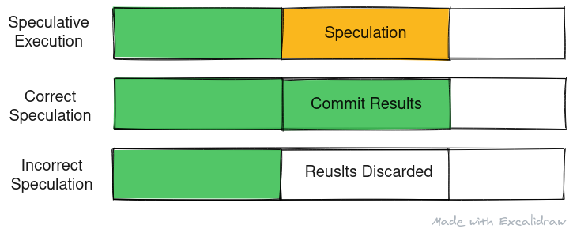
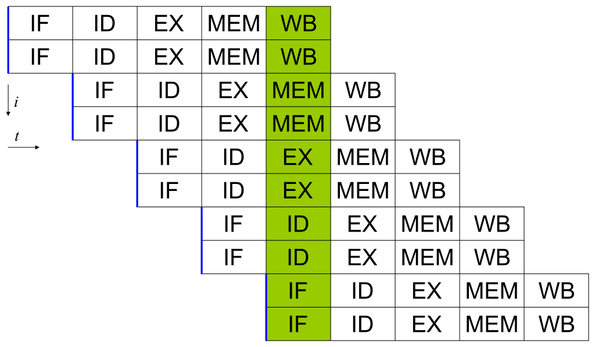
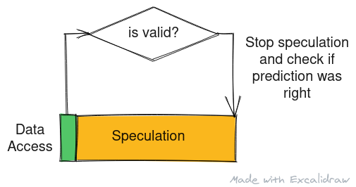

Most of the recent CPU vulnerability discovered depend on the property of modern processors known as Speculative Execution. In this post, we'll take a deeper look at where and why modern processors speculate.


<center>
Alt: A illustration that shows speculative execution and how the results are committed or discarded based on result of speculation - whether it was correct or not respectively.
<br/>
Made with <a href="https://excalidraw.com/" target="_blank">https://excalidraw.com/</a> (link opens a new tab)
</center>


## Pipelined Execution

Most modern processors are pipelined and are often superscalar in nature running instructions out of order, with multiple stages of execution of instruction running concurrently.



<center>
Alt: Pipeline of a superscalar processor with 2 instruction fetch every clock cycle and a 5 stage pipeline.
<br/>
Source (link opens a new tab): <a href="https://en.wikipedia.org/wiki/Superscalar_processor" target="_blank">https://en.wikipedia.org/wiki/Superscalar_processor</a>
</center>
<br />

In case of a long latency cache miss, permission check for an access or conditional branches, the processor generally has to stall waiting for these outstanding data and results to be fetched to continue execution. Generally a nop - signifying no operation, is sent through the pipeline and the process is known as stalling the pipeline.

Stalling pipeline is easy and safe but the processor could have been doing useful work in that time instead of sitting idle waiting for data or results. This expensive idling is what fueled the era or speculative execution


## Speculating Conditional Branches

Consider the following snippet of C code:

```c
unsigned int *ptr;
if (*ptr)
{
        do_something();
}
```

Consider the data pointed to by the address in pointer ptr is not cached, It'll take several hundreds of clock cycles to fetch the data from the main memory. Idling for hundreds of clock cycle especially in a superscalar processor massively degrades the performance.

In this case, processor goes into a state of speculation and starts executing instruction based on prediction of whether the branch will be taken or not. This process is known as branch prediction - we won't go into details of branch prediction in this post but if you want to learn more about branch prediction you can read the Wikipedia article titled <a href="https://en.wikipedia.org/wiki/Branch_predictor" target="_blank">Branch Prediction</a> (link opens a new tab) which talks briefly about the branch prediction algorithms but if you want to understand how modern processor implement branch prediction in hardware, you can read this blog by Cloudflare titled <a href="https://blog.cloudflare.com/branch-predictor/" target="_blank">Branch predictor: How many "if"s are too many? Including x86 and M1 benchmarks!</a> (link opens a new tab) where Marek Majkowski takes a look at how Branch Target Buffers work.


Coming back to the example snippet, the processor may speculate that the value at address pointed by ptr is indeed non zero and start executing the **do_something()** routine speculatively. It is only later, when the data arrives, will the processor come out of speculative execution state. In case of a mis-speculation, the pipeline is flushed, the processor state is reset to the point of speculation and the execution continues in the correct direction. On a high level, speculation is completely safe as the user cannot read the results computed during speculation and only after a speculation is deemed correct or incorrect, the user can see the changes reflect in the registers. 


## Speculating Permission Check

As it turns out, checking whether a program can access data at particular address takes quite some time. In this case too the processor speculates if the access if valid or not and continues with execution or program or stall respectively. Consider the same above example - if data at the address pointed by ptr is cached, the processor may speculate that this data indeed accessible to the userspace program and speculatively execute the following statement based on value at address pointed by ptr. It is only later, when the permission check is complete will the processor come out of speculative execution state. Same as before, in case of a mis-speculation, the pipeline is flushed, the processor state is reset to the point of speculation and the execution continues in the correct direction.


<center>
Alt: A block diagram that shows speculative execution in case that check for data access takes longer than fetching data. The processor comes out of the speculative state once the check has resolved.
<br/>
Made with <a href="https://excalidraw.com/" target="_blank">https://excalidraw.com/</a> (link opens a new tab)
</center>


## Pitfalls

The main pitfall of speculation is the fact that during a miss prediction, most processor reset their state but the traces of the speculation is left in caches and as seen in previous post of Timing Analysis, we can read the data from the cache using a device and timing analysis.


## Coming up next

In the next post we'll look at Meltdown, a CPU vulnerability that used speculative execution and timing analysis to read kernel memory.


Thank you for reading till the end. I'm an undergraduate student keenly interested in Computer Architecture and I look at micro-architectural based attacks to understand more about the working of our hardware. If you find any inaccuracies in the above post, please leave a comment and I'll address it in the next edit. Have a nice day!