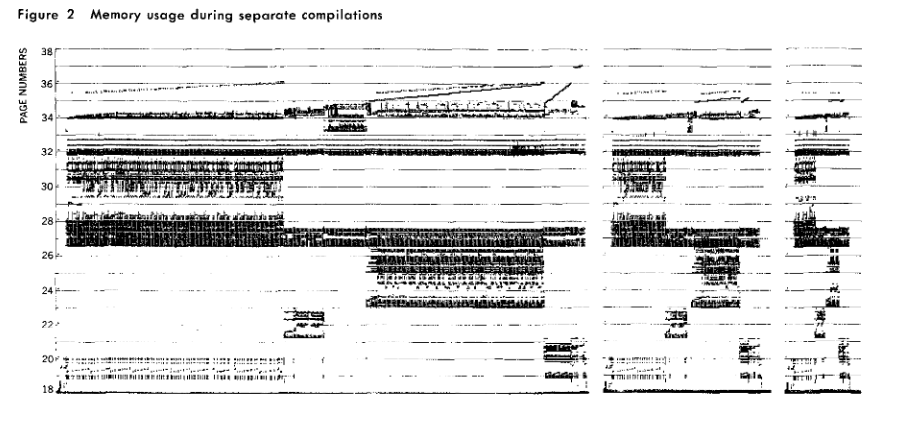
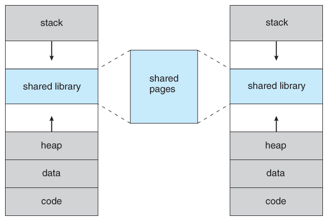
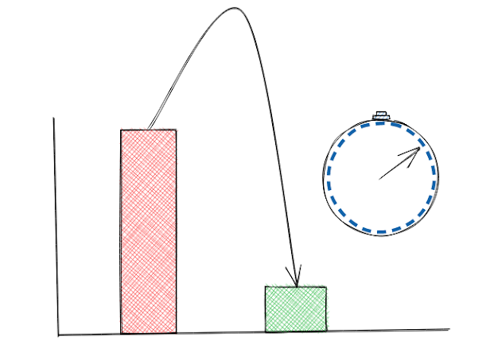

Welcome to out of order core, a blog that looks into computer micro-architecture and the micro-architectural vulnerabilities. Over the course of next few posts, we will be taking a dip in the world of Timing Analysis.

## Memory Hierarchy

Before we look at what timing analysis is, let us take a brief look at memory hierarchy of modern computer system.
A pyramid that depicts memory hierarchy with CPU registers on top followed by L1, L2, and L3 caches, followed by DRAM based memory followed by flash based drives such as Solid State Drive, followed by Hard Disk Drive. The registers and caches reside on CPU and are faster at resolving requests but are very small, the DRAM is larger and plenty fast compared to the Solid State Drive and Hard Disk Drive that takes milliseconds to resolve data.

Alt: A pyramid that depicts memory hierarchy with CPU registers on top followed by L1, L2, and L3 caches, followed by DRAM based memory followed by flash based drives such as Solid State Drive, followed by Hard Disk Drive. The registers and caches reside on CPU and are faster at resolving requests but are very small, the DRAM is larger and plenty fast compared to the Solid State Drive and Hard Disk Drive that takes milliseconds to resolve data. 
Source (link will open a new tab): <a href="https://sites.google.com/site/cachememory2011/memory-hierarchy" target="_blank">https://sites.google.com/site/cachememory2011/memory-hierarchy</a>

 
As we can see the CPU register sits on top and can generally be accessed every clock cycle of the CPU, followed by the L1, L2, L3 caches each having relatively small latency in 10s of cycles. The main memory access to the DRAM takes even longer and access to data in Solid State Drive (SSD) and Hard Disk Drive (HDD) can take milliseconds to resolve.

## Why is this hierarchy needed?

Assume CPU is repeatedly working on same data over and over again. Maybe this data is too large to store in the registers and CPU has to repeatedly access DRAM. As each DRAM access can take 100s of cycles, and CPU has to wait for the data to be brought it before it can work on it. Suppose this data, which is being repeatedly accessed, was stored in a small chunk of memory on the chip, the CPU wouldn't have to wait as long for data and can perform more efficiently as it spends more time working on data rather than waiting for it. This line of thinking gave us cache memory on our general purpose processors.
A plot of Page number on Y-Axis vs Time on X-Axis showing how addresses are repeatedly accessed over time and the concentrated parts show how the accesses have spacial and temporal locality.

Alt: A plot of Page number on Y-Axis vs Time on X-Axis showing how addresses are repeatedly accessed over time and the concentrated parts show how the accesses have spacial and temporal locality. 
Source (link will open a new lab): <a href="https://ieeexplore.ieee.org/document/5388264" target="_blank">D. J. Hatfield and J. Gerald, "Program restructuring for virtual memory," in IBM Systems Journal, vol. 10, no. 3, pp. 168-192, 1971, doi: 10.1147/sj.103.0168.</a>

## Shared Libraries

Before seeing what is timing analysis, we need to understand the concept of shared library. Consider two programs dependent on a common library. If we load this library twice into memory, it'll add to redundancy and lower the effective capacity. Modern OS use the concept of shared library and shared pages to reduce this type of redundancy. When the program runs, a stub tells the OS about an access to the shared library. If this library is not in memory, it is loaded into a shared page and its address is made known to the program. When another program requests access to this same library, OS supplies the address of this shared page back. This works really well when two programs share read only data.
The images hows the memory layout of two compiled programs and how the shared library section maps to the same shared page for both the programs.

Alt: The images hows the memory layout of two compiled programs and how the shared library section maps to the same shared page for both the programs. 
Source (link will open a new lab): <a href="https://www.cs.uic.edu/~jbell/CourseNotes/OperatingSystems/9_VirtualMemory.html" target="_blank">https://www.cs.uic.edu/~jbell/CourseNotes/OperatingSystems/9_VirtualMemory.html</a>

## Resource Sharing and Timing Analysis

Most processors today implement Hyperthreading or Simultaneous Multi Threading (SMT) where two hardware threads share resources between them such as the floating point unit and often the last-level caches or the L3 cache - the main idea behind this being these units are not busy / populated always by a single thread and two threads can keep this resource busy for longer as opposed to only a single one.

As we saw, smaller memory can resolve request faster compared to the larger one all owing to laws of physics. Consider in a system with Simultaneous Multi Threading where each core has to physical threads, the threads share the last level cache for all their data. Consider program in one thread runs a routine from a shared library and the program from other thread calls the same routine shortly after, the code for the routine is present in the last level cache and hence will run slightly faster for the second thread compared to the scenario where the second thread calls the routine and its not caches.

Looking at the time taken for execution, program on one thread can analyze the behavior of program on another thread. If the access to routine is based on the value of a secret, the attacker thread can do a timing analysis and leak the data from the victim thread.

An image that illustrates how the timing changes with cached and un-cached data exaggerated for emphasis.

Alt: An image that illustrates how the timing changes with cached and un-cached data exaggerated for emphasis. 
The picture is made using <a href="https://excalidraw.com/" target="_blank">https://excalidraw.com/</a> (link will open a new tab)

## Why can you expect next?

Over the next few posts, we will take a look practical techniques that allows an attacker to leak secrets from the victim. Stay tuned for the next post on Flush and Reload.

Thank you for reading till the end. I'm an undergraduate student keenly interested in Computer Architecture and I look at micro-architectural based attacks to understand more about the working of our hardware. If you find any inaccuracies in the above post, please reach out to me and I'll address it in the next edit. Have a nice day!